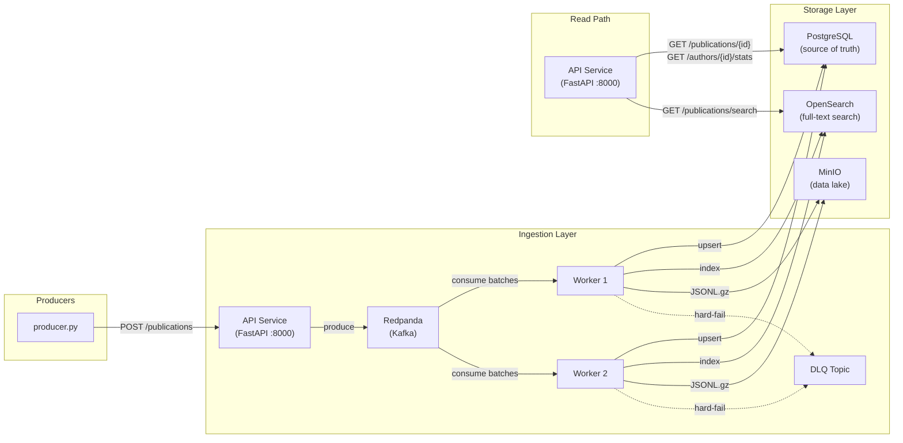

# Data Platform — Social Media Publications

A production-grade data platform for ingesting, storing, and querying billions of social media publications. Two workloads coexist without interference: low-latency API queries and heavy R&D/analytics batch reads.

---

## Quick Start

```bash
# 1. Start the full stack
docker compose up --build -d

# 2. Wait for all services to be healthy (~30-40 s)
docker compose ps          # all services should show "healthy" or "exited (0)"

# 3. Run the producer to start feeding data (requires Python 3.12+; Docker recommended)
docker build -t producer producer/
docker run --rm --network assesment_default producer --url http://api:8000/publications --workers 5

# 4. Run unit tests (no Docker needed)
pip install -r requirements.txt pytest
PYTHONPATH=src pytest tests/test_validation.py tests/test_stats.py -v

# 5. Run integration tests (Docker stack must be up)
pytest tests/test_api.py tests/test_search.py -v
```

### Useful URLs

| Service | URL |
|---------|-----|
| Publications API | http://localhost:8000 |
| API docs (Swagger) | http://localhost:8000/docs |
| Prometheus metrics (API) | http://localhost:8000/metrics |
| Prometheus metrics (worker) | http://localhost:9090 |
| OpenSearch | http://localhost:9200 |
| MinIO console | http://localhost:9001 (minioadmin/minioadmin) |
| Redpanda Kafka | localhost:19092 |

---

## Architecture



### Data Flow

1. **Producer** POSTs publications to the API (`POST /publications`).
2. **API** validates the Pydantic schema and produces the message to a **Redpanda** (Kafka-compatible) topic. Returns `202 Accepted` immediately — decouples HTTP latency from storage.
3. **Ingestion Workers** (horizontally scalable) consume in batches:
   - Run **data-quality checks** (hard-fail → DLQ, warn → log and continue).
   - Compute `engagement_rate` from metrics.
   - **Upsert** to PostgreSQL (source of truth, idempotent via `ON CONFLICT publication_url`).
   - **Bulk-index** to OpenSearch (for full-text search).
   - **Export** to MinIO as gzipped JSONL (data lake for R&D / analytics).
4. **Read path**: API serves `GET` endpoints directly from Postgres (point lookups, stats) and OpenSearch (search).

---

## Technology Choices & Trade-offs

| Component | Choice | Why |
|-----------|--------|-----|
| **Streaming buffer** | Redpanda | Kafka-compatible, single-binary, low resource footprint for local dev. Drop-in replacement for Apache Kafka in production. |
| **Source of truth** | PostgreSQL 16 | Battle-tested ACID, JSONB for flexible metrics, rich indexing (B-tree, partial, GIN). |
| **Full-text search** | OpenSearch | Purpose-built inverted index, fuzzy matching, relevance scoring. Decouples search workload from transactional DB. |
| **Data lake** | MinIO (S3-compatible) | R&D team can run Spark/DuckDB/Polars directly against gzipped JSONL or Parquet. Keeps heavy analytics off the transactional path. |
| **API framework** | FastAPI | Async, auto-docs (Swagger/ReDoc), Pydantic integration. |
| **Ingestion pattern** | Kafka consumer groups | Horizontal scaling by adding workers. At-least-once delivery + idempotent upserts = exactly-once semantics for the data. |

### Trade-offs

- **Eventual consistency on writes**: `POST` returns `202`; data is visible after the worker processes it (typically < 2 s). This is the right trade-off for high write throughput — the producer doesn't need synchronous confirmation.
- **Non-partitioned Postgres table**: For the local implementation, we use a standard table with B-tree indexes. For production (billions of rows), the table should be range-partitioned by `published_at` (see Migration Plan below).
- **OpenSearch replicas = 0**: Single-node setup for local dev. Production would use ≥ 1 replica.
- **JSONB for metrics**: Flexible schema allows per-platform metrics without migrations, at the cost of not having columnar storage efficiency. For analytics, the MinIO data lake (with Parquet conversion) compensates.

---

## API Endpoints

| Method | Path | Description |
|--------|------|-------------|
| `POST` | `/publications` | Insert or update a publication (upsert by `publication_url`). Returns `202 Accepted`. |
| `GET` | `/publications/{publication_id}` | Fetch a single publication by UUID. |
| `GET` | `/publications/search?q=&...` | Full-text search on title/description/author_name with filters on `author_id`, `published_at`, `created_at`, engagement rate. |
| `GET` | `/authors/{author_id}/stats` | Total posts and average engagement rate (excludes deleted). |
| `GET` | `/health` | Health check. |
| `GET` | `/metrics` | Prometheus metrics. |

### Engagement Rate Formula

```
engagement_rate = (likes + views + comments + shares) / follower_count_at_post
```

### Data Quality Rules

| Rule | Behavior |
|------|----------|
| `publication_url`, `author_id`, `published_at` are null | **Hard fail** — rejected, sent to DLQ |
| `engagement_rate` not in [0, 100] | **Hard fail** |
| `published_at` in the future | **Hard fail** |
| `published_at` older than 24 h | **Warn** — logged, ingested normally |
| Duplicate `publication_url` | **Warn** — logged, existing record updated (upsert) |

---

## Schema Evolution — Migration Plan

### Adding `platform` field

**Goal**: Add an optional `platform` column (`instagram | tiktok | youtube | other`) without downtime while ingestion and API continue to serve live traffic.

#### Phase 1 — Backward-compatible column addition

```sql
-- Migration 001 already creates the column as nullable:
-- platform VARCHAR(20) DEFAULT NULL
-- Migration 002 adds the CHECK constraint and index:
ALTER TABLE publications ADD CONSTRAINT ck_publications_platform
  CHECK (platform IS NULL OR platform IN ('instagram','tiktok','youtube','other'));
CREATE INDEX ix_publications_platform ON publications (platform);
```

- **Zero downtime**: `ALTER TABLE ADD COLUMN ... DEFAULT NULL` is metadata-only in PostgreSQL (no table rewrite).
- **Backward compatible**: Old records have `platform = NULL`, old code ignores the column, new code checks for NULL.
- **OpenSearch**: The mapping already accepts `platform` as a `keyword` field. Documents without it are handled gracefully.

#### Phase 2 — Application rollout (rolling deploy)

1. Deploy new **worker** version that writes `platform` when present in the Kafka message.
2. Deploy new **API** version that returns `platform` in responses and accepts it in `POST`.
3. Deploy new **producer** version that includes `platform` in outgoing messages.
4. Old messages (without `platform`) continue to work — the field defaults to `NULL`.

#### Phase 3 — Per-platform metrics

The `metrics` column is `JSONB`, so each platform can add new fields without a schema migration:

```json
{
  "likes": 100,
  "views": 500,
  "comments": 10,
  "shares": 5,
  "follower_count_at_post": 10000,
  "instagram_saves": 50,
  "instagram_reach": 5000
}
```

- Existing code reads only the base fields it knows about.
- Analytics queries can use `metrics->>'instagram_saves'` directly.
- OpenSearch dynamic mapping auto-detects new numeric fields in the `metrics` object.
- The engagement rate formula uses only the base fields, so new platform metrics don't break it.

#### Phase 4 — Partitioning (production)

For production with billions of rows:

```sql
-- 1. Create new partitioned table
CREATE TABLE publications_partitioned (...) PARTITION BY RANGE (published_at);

-- 2. Create monthly partitions
CREATE TABLE publications_y2024m01 PARTITION OF publications_partitioned
  FOR VALUES FROM ('2024-01-01') TO ('2024-02-01');
-- ... repeat for each month

-- 3. Migrate data in batches (off-peak)
INSERT INTO publications_partitioned SELECT * FROM publications
  WHERE published_at >= '2024-01-01' AND published_at < '2024-02-01';

-- 4. Swap tables atomically
ALTER TABLE publications RENAME TO publications_old;
ALTER TABLE publications_partitioned RENAME TO publications;

-- 5. Verify and drop old table
```

For true URL uniqueness with partitioning, use a separate `publication_urls(publication_url UNIQUE, publication_id)` lookup table.

---

## Scaling Strategy

| Concern | Approach |
|---------|----------|
| **Write throughput** | Add more Kafka partitions + worker replicas. Workers in the same consumer group auto-rebalance. |
| **Read throughput (API)** | Add API replicas behind a load balancer. Stateless service. |
| **Search latency** | Add OpenSearch data nodes + replicas. |
| **Postgres growth** | Range-partition by `published_at`; archive old partitions to the data lake. |
| **Analytics isolation** | R&D reads from MinIO (JSONL/Parquet), never touches Postgres or OpenSearch. |

---

## What I Would Do Differently With More Time

1. **Partitioned Postgres table** with `pg_partman` for automatic monthly partition management and a URL lookup table for cross-partition uniqueness.
2. **Parquet export** instead of JSONL — columnar format is much more efficient for analytics (Spark, DuckDB, Polars).
3. **Schema registry** (e.g., Confluent Schema Registry or Redpanda's built-in) to enforce Avro/Protobuf schemas on the Kafka topic and catch breaking changes before they reach workers.
4. **CDC (Change Data Capture)** via Debezium to stream Postgres changes to OpenSearch instead of dual-writing — eliminates the risk of Postgres/OpenSearch divergence.
5. **Grafana + Prometheus stack** with pre-built dashboards for ingestion rate, DLQ rate, search latency P99, and Kafka consumer lag.
6. **Dead letter queue consumer** that retries or alerts on validation failures.
7. **Rate limiting and authentication** on the API.
8. **End-to-end integration tests** with testcontainers for fully isolated CI pipelines.
9. **Blue-green deployment pipeline** for zero-downtime migrations in production.
10. **Read replicas** for Postgres to further isolate the stats aggregation workload.

---

## Project Structure

```
.
├── docker-compose.yml          # Full stack: Postgres, Redpanda, OpenSearch, MinIO, API, Workers
├── Dockerfile                  # Shared image for API + Worker + Migrations
├── requirements.txt            # Python dependencies
├── alembic.ini                 # Alembic configuration
├── migrations/
│   ├── env.py
│   └── versions/
│       ├── 001_initial_schema.py
│       └── 002_add_platform.py
├── src/
│   ├── shared/                 # Shared code: models, config, validation, DB, Kafka, OpenSearch
│   │   ├── config.py
│   │   ├── models.py
│   │   ├── validation.py
│   │   ├── database.py
│   │   ├── kafka_utils.py
│   │   └── search.py
│   ├── api/                    # FastAPI service (port 8000)
│   │   └── main.py
│   └── worker/                 # Kafka ingestion worker
│       └── main.py
├── tests/
│   ├── test_validation.py      # Unit tests (no Docker needed)
│   ├── test_stats.py           # Unit tests for engagement rate
│   ├── test_api.py             # Integration tests (needs Docker stack)
│   └── test_search.py          # Integration tests for search filters
├── producer/                   # Provided producer (unchanged)
└── consumer/                   # Provided consumer (reference, superseded by this platform)
```
